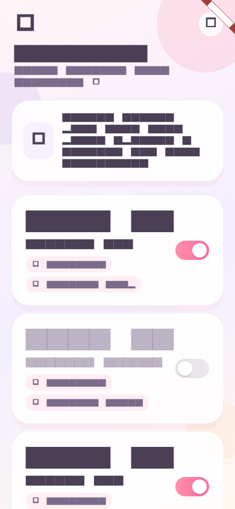
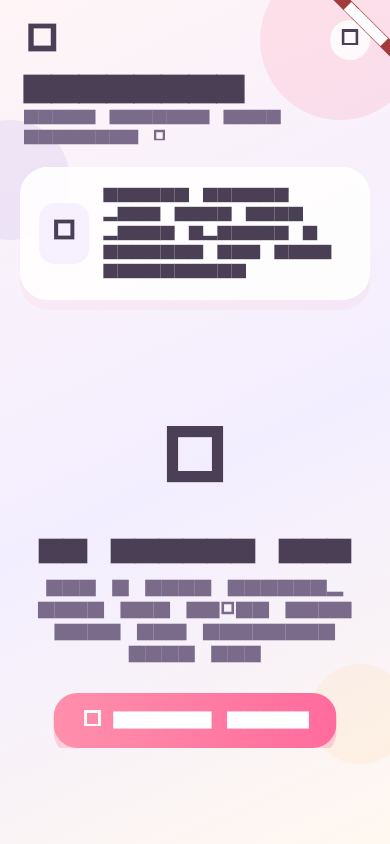
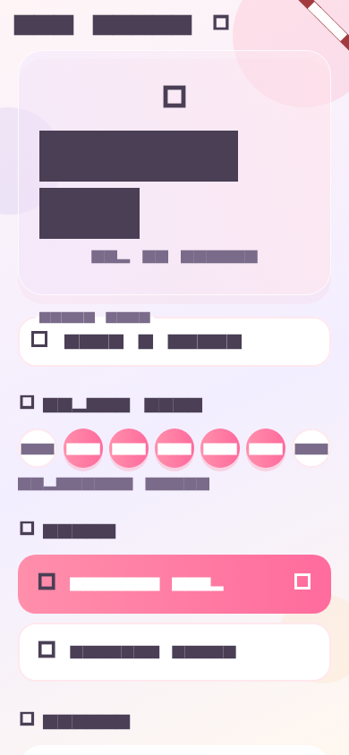
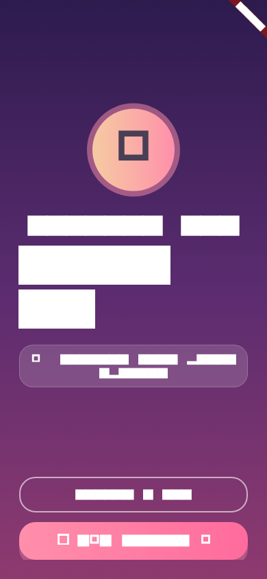

# UI Screenshots

Previews of the OuttaBed app interface.

| Home (with alarms) | Empty state |
|---|---|
|  |  |

| New alarm | Alarm ringing |
|---|---|
|  |  |

To regenerate after UI changes:

```bash
flutter test --update-goldens test/generate_screenshots_test.dart
```
